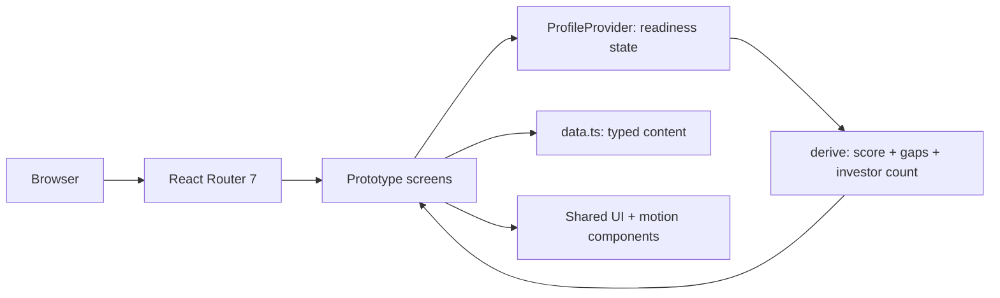

# YÖN

A founder-facing product that clarifies the path to financing and prepares the entrepreneur to walk it — built as a fully interactive front-end prototype from an approved design specification.

## Overview

YÖN is a product for early-stage founders who need to understand where they stand before approaching any financing source. The core idea: a structured assessment produces a financing path — showing which routes make sense given the startup's current state — and a readiness diagnosis with prioritised gaps and a personalised action plan for closing them.

The repository contains a front-end prototype. The product model (described below) defines the intended end-to-end journey; the prototype implements the core founder-facing interaction model. There is no backend, no database and no persistence — state and content live in a typed module inside the app.

Status: working demo deployed at https://yon-dev.vercel.app/ (preview build). Not a production system.

## The Problem

Founders approaching their first financing round rarely fail because their company is fundamentally bad. They fail because they arrive unprepared — unable to answer the questions any financing source will ask, and unable to identify which of many possible gaps actually matters first.

"Improve your pitch" is not actionable. "Your financial model is missing, and that is the specific item preventing you from qualifying for two of the programmes relevant to your stage" is. YÖN's premise is that a structured readiness evaluation can surface that specificity — and that doing so before any outreach saves both the founder and the evaluator significant time.

## Product Model

### Intended Founder Journey

YÖN is designed around a seven-stage loop:

1. **Assessment** — A structured intake covering company, team, product and traction, financials and target, and document readiness.
2. **Financing Path** — Based on assessment results, YÖN surfaces the financing routes that are relevant to the startup's current profile (grant programmes, accelerators, angel, VC, or a recommendation to validate further before approaching any source). YÖN clarifies the path; it does not guarantee eligibility or funding outcomes.
3. **Readiness Diagnosis** — An overall readiness score against a target threshold, with a per-category breakdown.
4. **Critical Gaps** — The specific items blocking progress, ranked by priority, with the reason each gap matters to the relevant financing source.
5. **Personalized Action Plan** — A structured roadmap for closing the identified gaps in the right order.
6. **Progress Tracking** — An ongoing view of progress against the action plan as the founder works through it.
7. **Re-assessment** — The loop closes: as gaps close, the founder re-evaluates and the financing path updates accordingly.

### What the Prototype Implements

The current prototype covers the majority of the founder-facing journey:

| Journey Stage | Prototype Screen | Status |
|---|---|---|
| Assessment | `/girisim/degerlendirme` | ✅ Implemented |
| Financing Path | _(derived from assessment; no dedicated screen)_ | 🔲 Not a standalone screen in this build |
| Readiness Diagnosis | `/girisim/rapor` | ✅ Implemented |
| Critical Gaps | Section within `/girisim/rapor` | ✅ Implemented |
| Personalized Action Plan | `/girisim/yol-haritasi` | ✅ Implemented |
| Progress Tracking | `/girisim/ilerleme` | ✅ Implemented |
| Re-assessment | _(intended next iteration of the loop)_ | 🔲 Not a standalone completed feature |

The implemented founder flow demonstrates the core interaction model: changing an assessment answer updates the readiness diagnosis, identified gaps and action plan through a shared state model.

## Financing Path

A central product idea in YÖN is that not every startup should be approaching every financing source — and arriving at the wrong door before you're ready is costly for both sides. Based on the assessment, YÖN surfaces the routes that are most relevant to the startup's current profile: public grant programmes (e.g. TÜBİTAK/BiGG, KOSGEB), accelerator tracks, angel networks, or venture capital. For startups that are not yet ready for any structured financing, it surfaces that conclusion too, along with the specific steps needed to get there.

YÖN does not determine eligibility or guarantee outcomes. It clarifies the landscape so the founder can make a more informed decision about where to focus preparation effort.

## Investor Layer

The prototype includes a complete investor-side journey: investment criteria configuration (`/yatirimci/kriterler`), a filtered deal-flow pipeline (`/yatirimci/dealflow`), a detailed startup profile view (`/yatirimci/girisim/:id`), and a matched-investors screen for the founder (`/girisim/yatirimcilar`) showing fit scores and per-criterion match breakdowns.

This layer is fully implemented and navigable in the prototype. It is not, however, the primary positioning of the product. YÖN's core value proposition is founder-facing: clarifying the path to financing and building readiness to walk it. The investor layer demonstrates how the same underlying readiness evaluation could support the other side of the table — but investor matching is a secondary consideration in the current product direction, not the lead feature.

## My Role

Sole developer. I implemented the entire application:

- Translated seven approved screens into React components without redesigning them, sampling colour and typography tokens from the design document into a CSS custom-property layer.
- Designed the shared readiness state layer (`src/state/profile.tsx`) — a React context that owns the founder's assessment answers and *derives* the score, gap list and investor count from them, so every screen reads one source of truth rather than maintaining its own copy.
- Implemented the scoring and unlock rules: per-field score and investor deltas, clamping, and the mapping from a specific missing item to the specific investor it blocks.
- Implemented the investor-side criteria model: a breadth × headroom × strictness calculation that shrinks the qualifying pool as criteria tighten.
- Built the shared component library (`Card`, `Btn`, `Chip`, `Pill`, `SegBar`, `Avatar`, `Check`, `Micro`) and the application shell with role-aware sidebar navigation.
- Built the motion system: three duration tiers on a single easing curve, staggered reveals, and an animated number counter driven by a custom `requestAnimationFrame` hook that resumes from its current value when interrupted mid-count.
- Implemented accessibility behaviour for reduced motion at two levels — a root `MotionConfig reducedMotion="user"` and a `prefers-reduced-motion` CSS block — so content appears in place instead of disappearing.
- Configured the build and the Vercel deployment.

AI coding assistance was used during development; the architecture, the state model, the scoring rules and the final code are mine and I reviewed everything that shipped.

## Architecture

A single-page React application with no server component. State lives in a React context; content lives in a typed module; routing is client-side.

- **Frontend:** React 19, TypeScript (strict), Vite 6, React Router 7, Framer Motion 13.
- **State:** a single React context provider. Assessment answers are the only stored state; score, gap list, match count and investor unlocks are all derived values, never stored.
- **Styling:** hand-written CSS split into a token layer, a base layer and per-surface layers. No UI framework.
- **Fonts:** Plus Jakarta Sans and IBM Plex Mono via `@fontsource` — no external CDN dependency at runtime.
- **Backend / database / authentication:** none. Not implemented in this repository.
- **Deployment:** static build on Vercel.

## Key Technical Decisions

**Derive, never duplicate.** The context stores assessment answers and nothing else. The score, the gap list, the investor count and the set of unlocked investors are computed from those answers on every render. This is why changing one field in the assessment consistently updates the diagnosis, the gap list and the investor screen without any synchronisation code.

**Scoring as a data table, not branching logic.** Each field maps to a small table of `{ score, investors }` deltas per possible answer, applied against a base and clamped. Changing the weight of any single item is a one-line edit to a constant. The entire weighting model is auditable in roughly fifteen lines.

**Locked matches modelled explicitly.** Rather than filtering investors out silently, each locked investor is bound to the readiness key that blocks it, so the UI can state *which* gap is in the way and what the fit score would become once it closes. This turns a filter into actionable guidance — even in the context of a secondary product layer.

**Keep the transition in the number itself.** The animated counter runs its own `requestAnimationFrame` loop and continues from its current value when the target changes mid-animation, rather than snapping and restarting. A score moving 72 → 81 while the user watches is the moment the product's value lands; a jump-cut would waste it.

**A segmented bar as the signature primitive.** `SegBar` renders a ratio as discrete vertical segments and can shade the span between the current value and a target threshold in a warning colour — one component covering the readiness bar, the category breakdowns, the criteria threshold slider and the live-result panel.

## Core Features

**Founder funding-readiness loop**
- Multi-section startup assessment with a live projected score that updates as answers change.
- Readiness diagnosis with an overall score against a target threshold and a per-category breakdown.
- Critical gaps ranked by priority with an explanation of why each gap matters to the relevant financing source.
- Personalised action plan and progress tracking for working through the gaps.

**Investor layer** *(implemented in the prototype; secondary to the founder journey)*
- Investor matching with an explicit met / not-met criteria list per investor — fit is explainable, not an opaque percentage.
- Locked matches tied to a specific missing item, showing the fit score that closing it would unlock.
- Investor criteria configuration with a live qualifying-pool count that recomputes as sectors, stages, geographies, threshold and strictness change.
- Deal-flow pipeline with status tabs and per-startup readiness / fit indicators.
- Startup detail view with readiness breakdown, "why this matched" reasoning and risk list.

**Product foundation**
- A complete design system: tokens, shared components and a single coherent motion language with reduced-motion support at both the library and CSS levels.

## Technical Challenges

**Keeping two user journeys consistent from one model.** The founder screens and the investor screens present the same underlying evaluation from opposite directions — a score to improve on one side, a filter to apply on the other. Approach: put the derivation in one place and let both sides read it, rather than letting each screen compute what it needs. Result: the demo's central interaction — change one answer, watch the score, the report and the match list all move together — works without cross-screen wiring.

**Making live recalculation feel like a real system.** The investor-criteria panel has to respond to five interacting inputs and produce a plausible number instantly. Approach: a single `useMemo` combining criteria breadth across three axes, headroom from the readiness threshold, and a strictness penalty per required criterion, calibrated so the design's default configuration reproduces the design's stated result. Result: every control has a visible, directionally correct effect, and the calibration is documented in the code so the numbers are not mysterious.

**Motion that survives interruption.** Reveal animations and counters overlap with user input. Approach: one shared duration/easing family, a hook that owns its own animation frame loop and reads from its live current value, and reduced-motion handling at both the library and CSS levels. Result: rapid interaction never leaves the UI in a half-animated state, and users with reduced-motion enabled lose nothing but the movement.

## Product / Engineering Outcome

A complete, deployed, interactive prototype that covers the founder funding-readiness journey across multiple screens and implements the investor layer as a secondary but fully navigable flow. All designed screens are implemented, both journeys are walkable end to end, and the core product loop — change an answer, watch the readiness score, the gap list and the action plan respond — is functional rather than mocked.

What it is not: there is no backend, no user accounts, no persistence and no real investor or financing-source data. The repository contains no usage metrics, and none are claimed.

## Current Status

**Implemented**
- Assessment (`/girisim/degerlendirme`) — five-section intake with live score and gap projection.
- Readiness diagnosis and critical gaps (`/girisim/rapor`) — score vs. target threshold, per-category breakdown, prioritised gap list.
- Personalised action plan (`/girisim/yol-haritasi`).
- Progress tracking (`/girisim/ilerleme`).
- Investor layer: matched investors (`/girisim/yatirimcilar`), criteria configuration (`/yatirimci/kriterler`), deal-flow pipeline (`/yatirimci/dealflow`), startup detail (`/yatirimci/girisim/:id`).
- Shared readiness state with derived scoring, gap list and investor unlock logic.
- Design token system, shared component library, motion system, reduced-motion support.
- Production build on Vercel.

**Not implemented in this prototype**
- Financing Path as a dedicated screen (currently implicit in assessment output; no standalone route).
- Re-assessment as a completed end-to-end loop closure.
- Backend API, database and persistence.
- Authentication and user accounts.
- Real financing-source or investor data — all content is sample data.
- PDF export — action present in the UI; no generation implemented.

## Demo & Deployment

**Production site:** https://yon-dev.vercel.app/
- `/` — current YÖN landing page.
- Product routes — Coming Soon; not yet accessible in production.

**Development previews:** branch-based Vercel preview deployments expose the full interactive prototype for development and review. All screens and both journeys (founder and investor layer) are navigable there.

| # | Screen | Route | What it shows |
|---|--------|-------|--------------|
| 01 | Entry | `/` | Product positioning and role selection |
| 02 | Assessment | `/girisim/degerlendirme` | Intake form with live score and gap panel |
| 03 | Readiness diagnosis | `/girisim/rapor` | Score vs. threshold, category breakdown, gaps |
| 04 | Action plan | `/girisim/yol-haritasi` | Structured steps to close identified gaps |
| 05 | Progress tracking | `/girisim/ilerleme` | Progress view against the plan |
| 06 | Matched investors | `/girisim/yatirimcilar` | Fit scores, per-criterion breakdown, locked matches |
| 07 | Investor criteria | `/yatirimci/kriterler` | Criteria configuration with live qualifying-pool count |
| 08 | Deal flow | `/yatirimci/dealflow` | Filtered pipeline with status tabs |
| 09 | Startup detail | `/yatirimci/girisim/:id` | Full profile: readiness, fit reasoning, risks |

The most useful thing to demonstrate is the core loop: on screen 02, change any readiness answer and walk forward to screens 03, 04 and 05 to watch the score, the gap list and the plan respond in real time.

## Tech Stack

**Frontend**
- React 19, TypeScript 5.7 (strict)
- React Router 7
- Framer Motion 13
- Hand-written CSS with a custom-property token layer

**Build & tooling**
- Vite 6, `@vitejs/plugin-react`
- `@fontsource` (Plus Jakarta Sans, IBM Plex Mono) — self-hosted, no CDN

**Infrastructure**
- Vercel (static hosting)

**Backend / database / AI**
- None in this repository.

## Repository

Private repository — source code is not publicly available.

Public demo: https://yon-dev.vercel.app/

## What I Learned

**Deriving beats storing.** Putting the score in state alongside the answers would have worked on day one and broken on day three. Making the score a pure function of the answers meant that every new screen reading it was correct by construction — and it made the product's most important interaction (the improvement loop) fall out of the architecture rather than needing to be built separately.

**Explainability is a data-modelling decision, not a copywriting one.** "92% fit" is useless on its own. Getting to "matched on sector, geography, stage and readiness threshold; not matched on traction" required modelling criteria as individually evaluable items from the start. Once the data has that shape, the interface can be honest; if the data is just a number, no amount of UI work can recover the reasoning.

**Translating a visual system into a functional product.** The constraint was to build the approved screens faithfully, not to redesign them — which pushed the engineering effort into what actually mattered: a token layer faithful to the source, a single motion language instead of per-screen animation, and a shared primitive (`SegBar`) reused across four different contexts. Adapting a reference-driven interface means holding three things in balance at once: visual intent, interaction fidelity and responsive behaviour. When they pull in different directions, the answer is almost always to resolve the conflict in the component layer rather than in the layout.

**Know what a prototype is claiming.** This application looks like a working system, which makes it easy to over-describe. Keeping the boundary explicit — real logic here, sample data there, no backend at all — is part of building the thing responsibly, especially when the demo is shown to people evaluating the product.

---

[Türkçe versiyon için bkz. yon.md](./yon.md)
