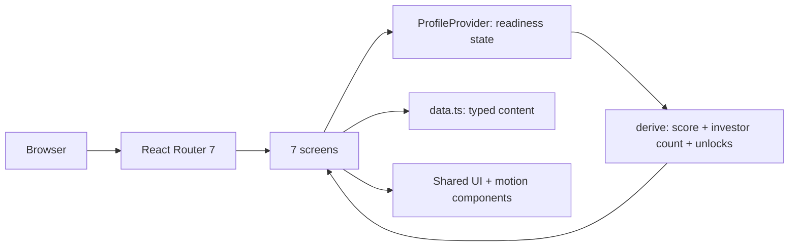

# YÖN

An investment-readiness and investor-matching product for early-stage startups, built as a fully interactive front-end prototype from an approved design specification.

## Overview

YÖN is a two-sided product concept: entrepreneurs measure how ready they are to raise capital and see which investors they currently qualify for, while investors define their investment criteria once and receive a pre-filtered deal flow.

The repository in its current state is a **front-end prototype**. All seven screens of the approved design are implemented and interactive, the readiness score and investor-match counts are computed at runtime from user input, and the flows connect end to end. There is no backend, no database and no persistence — the underlying content lives in a typed data module inside the app.

I built the application on my own, working from a finalised design document (`final_tasarım.pdf`) rather than redesigning the screens: my job was to turn a static design into a product that actually behaves like one.

Status: working demo, deployed. Not a production system.

## The Problem

Two problems sit on either side of the same table.

Founders raising a first round rarely fail because their company is bad — they fail because they approach investors before they can answer the questions those investors will ask, and because they cannot tell which of a dozen possible gaps actually matters. "Improve your pitch" is not actionable. "Your financial model is missing, and that is the single item that unlocks two more investors in your range" is.

Investors have the mirror-image problem: they receive far more startups than fit their thesis, and the filtering work is manual and repetitive. Stage, sector, geography, cheque size and minimum readiness are stable, explicit criteria — but nothing applies them automatically before the deal reaches a human.

YÖN's product bet is that the same underlying evaluation can serve both sides: a structured readiness assessment produces a score for the founder and a filter for the investor.

## The Product

### Entrepreneur journey

1. **Assessment** (`/girisim/degerlendirme`) — a five-section intake covering company, team, product and traction, financials and target, and document readiness. The final section drives the live model: pitch deck, financial model, incorporation status and cap table. A side panel updates the projected score and match count as answers change.
2. **Readiness report** (`/girisim/rapor`) — an overall score against a target threshold, a per-category breakdown (Team, Traction, Market, Financial structure, Document readiness), and prioritised gaps ranked high/medium/low with the reason each one matters to an investor.
3. **Matched investors** (`/girisim/yatirimcilar`) — matched funds with a fit percentage and an explicit criterion-by-criterion breakdown showing which criteria are met and which are not. Below them sit **locked** investors, each labelled with the specific gap blocking the match and the fit score that gap would unlock.

The loop is the point: closing a gap in step 1 raises the score in step 2 and moves a locked investor into the open list in step 3, in real time, without a page reload.

### Investor journey

1. **Investment criteria** (`/yatirimci/kriterler`) — sector focus, stage, geography, cheque range, a draggable minimum-readiness threshold, and additional criteria set to required / preferred / not needed. A live panel recomputes how many startups in the pool still qualify as the criteria change, alongside "flexibility scenarios" showing what relaxing a given constraint would yield.
2. **Deal flow** (`/yatirimci/dealflow`) — the filtered pipeline with status tabs (new / reviewed / interested), showing readiness, fit and criteria-match count per startup, plus how many startups were filtered out automatically.
3. **Startup detail** (`/yatirimci/girisim/:id`) — the full profile: reported metrics, MRR trend, readiness breakdown by category, document checklist, an explicit "why this matched" list, risks, and accept/pass actions that return to the deal flow.

## My Role

Sole developer. I implemented the entire application:

- Translated the seven approved screens into React components without redesigning them, including sampling the colour and typography tokens from the design document into a CSS custom-property layer.
- Designed the shared readiness state layer (`src/state/profile.tsx`) — a React context that owns the founder's readiness answers and *derives* the score and investor count from them, so every screen reads one source of truth instead of holding its own copy.
- Implemented the scoring and unlock rules: per-field score and investor deltas, clamping, and the mapping from a specific missing item to the specific investor it blocks.
- Implemented the investor-side criteria model: a breadth × headroom × strictness calculation that shrinks the qualifying pool as criteria tighten.
- Built the shared component library (`Card`, `Btn`, `Chip`, `Pill`, `SegBar`, `Avatar`, `Check`, `Micro`) and the application shell with role-aware sidebar navigation.
- Built the motion system: three duration tiers on a single easing curve, staggered reveals, and an animated number counter driven by a custom `requestAnimationFrame` hook that resumes from its current value when interrupted mid-count.
- Implemented accessibility behaviour for reduced motion at two levels — a root `MotionConfig reducedMotion="user"` and a `prefers-reduced-motion` CSS block — so content appears in place instead of disappearing.
- Configured the build and the Vercel deployment.

AI coding assistance was used during development; the architecture, the state model, the scoring rules and the final code are mine and I reviewed everything that shipped.

## Architecture

A single-page React application with no server component. State lives in a React context; content lives in a typed module; routing is client-side.

- **Frontend:** React 19, TypeScript (strict), Vite 6, React Router 7, Framer Motion 13.
- **State:** a single React context provider. Readiness answers are the only stored state; score, match count and unlocked investors are all derived values, never stored.
- **Styling:** hand-written CSS split into a token layer, a base layer, and per-surface layers. No UI framework.
- **Fonts:** Plus Jakarta Sans and IBM Plex Mono bundled through `@fontsource`, so the app has no external CDN dependency at runtime.
- **Backend / database / authentication:** none. Not implemented in this repository.
- **Deployment:** static build served on Vercel. No environment variables and no secrets are required to run it.

## Key Technical Decisions

**Derive, never duplicate.** The context stores four readiness answers and nothing else. The score, the investor count and the set of unlocked investors are computed from those answers on every render. The alternative — storing a score and updating it alongside the answers — is exactly how two screens end up disagreeing. This is why changing one field in the assessment consistently updates the report and the investor list without any synchronisation code.

**Scoring as a data table, not branching logic.** Each field maps to a small table of `{ score, investors }` deltas per possible answer, applied against a base and clamped. Changing how much a missing financial model costs is a one-line edit to a constant, with no control flow to re-read. It also keeps the numbers auditable — you can see the whole weighting model in about fifteen lines.

**Locked matches modelled explicitly.** Rather than filtering investors out silently, each locked investor is bound to the readiness key that blocks it, so the UI can say *which* gap is in the way and what the fit would become once it closes. This turns a filter into product guidance, and it is what makes the founder loop (assess → report → matches → back to assess) worth walking.

**Keep the transition in the number itself.** The animated counter runs its own `requestAnimationFrame` loop and, when the target changes mid-animation, continues from wherever it currently is instead of snapping and restarting. A score moving 72 → 81 while the user watches is the moment the product's value lands; a jump-cut would waste it.

**A segmented bar as the signature primitive.** `SegBar` renders a ratio as discrete vertical segments and can shade the span between the current value and a target threshold in a warning colour — one component covering the readiness bar, the category breakdowns, the criteria threshold slider and the live-result panel.

## Core Features

- Multi-section startup assessment with live projected score and match count.
- Readiness scoring with per-category breakdown and prioritised, explained gaps.
- Investor matching with an explicit met / not-met criteria list per investor — matches are explainable, not opaque percentages.
- Locked matches tied to a specific missing item, showing the fit score that closing it would unlock.
- Investor criteria configuration with a live qualifying-pool count that recomputes as sectors, stages, geographies, threshold and strictness change.
- Deal-flow list with status tabs and per-startup readiness / fit / criteria-match indicators.
- Startup detail view with reported metrics, MRR trend, readiness breakdown, "why this matched" reasoning and risk list.
- A complete design system: tokens, shared components, and a single coherent motion language with reduced-motion support.

## Technical Challenges

**Keeping two user journeys consistent from one model.** The founder screens and the investor screens present the same underlying evaluation from opposite directions — a score to improve on one side, a filter to apply on the other. Approach: put the derivation in one place and let both sides read it, rather than letting each screen compute what it needs. Result: the demo's central interaction — change one answer, watch the score, the report and the match list all move together — works without cross-screen wiring.

**Making live recalculation feel like a real system.** The investor-criteria panel has to respond to five interacting inputs and produce a plausible number instantly. Approach: a single `useMemo` combining criteria breadth across three axes, headroom from the readiness threshold, and a strictness penalty per required criterion, calibrated so the design's default configuration reproduces the design's stated result. Result: every control has a visible, directionally correct effect, and the calibration is documented in the code so the numbers are not mysterious.

**Motion that survives interruption.** Reveal animations and counters overlap with user input. Approach: one shared duration/easing family, a hook that owns its own animation frame loop and reads from its live current value, and reduced-motion handling at both the library and CSS levels. Result: rapid interaction never leaves the UI in a half-animated state, and users with reduced-motion enabled lose nothing but the movement.

## Product / Engineering Outcome

A complete, deployed, interactive prototype covering both sides of the product. All seven designed screens are implemented, both journeys are navigable end to end, and the core product loop — close a gap, watch the score and matches respond — is functional rather than mocked with static images.

What it is not: there is no backend, no user accounts, no persistence and no real investor data. The repository contains no metrics about usage, and none are claimed.

## Current Status

**Completed**
- All 7 designed screens, implemented to the approved design.
- Entrepreneur flow: assessment → readiness report → matched investors, including the return loop.
- Investor flow: criteria → deal flow → startup detail, including the return-after-decision path.
- Shared readiness state with derived scoring, investor counts and unlock logic.
- Investor criteria model with live qualifying-pool recalculation.
- Design token system, shared component library, motion system, reduced-motion support.
- Production build and Vercel deployment.

**In development / not implemented**
- Backend API, database and persistence.
- Authentication and user accounts.
- Real investor and startup data; all content is sample data from the design.
- PDF export — the report screen has a PDF action in the UI, but no generation is implemented behind it.
- The sidebar's "Interests" and "Settings" links intentionally route to a placeholder screen, since no design exists for them.

**Planned**
- Not documented in the repository.

## Screenshots / Demo

Live demo: **https://yon-dev.vercel.app/**

No screenshot files are stored in the repository. Suggested captures, by route:

| # | Screen | Route | What it shows |
|---|--------|-------|---------------|
| 01 | Entry & role selection | `/` | Product framing and the split into the two journeys |
| 02 | Startup assessment | `/girisim/degerlendirme` | Readiness intake with the live score/match panel |
| 03 | Investment readiness report | `/girisim/rapor` | Score vs. target threshold, category breakdown, prioritised gaps |
| 04 | Matched investors | `/girisim/yatirimcilar` | Fit scores, per-criterion match breakdown, locked matches |
| 05 | Investment criteria | `/yatirimci/kriterler` | Criteria configuration with live qualifying-pool count |
| 06 | Deal flow | `/yatirimci/dealflow` | Filtered pipeline with status tabs and fit indicators |
| 07 | Startup detail | `/yatirimci/girisim/:id` | Metrics, MRR trend, "why this matched", risks, decision actions |

*[Screenshot placeholder — images not captured yet.]*

The most useful thing to demonstrate live is the loop: on screen 02, set *Financial model* to *Var*, then walk forward to 03 and 04 and watch the score, the report gaps and the investor list respond.

## Tech Stack

**Frontend**
- React 19, TypeScript 5.7 (strict)
- React Router 7
- Framer Motion 13
- Hand-written CSS with a custom-property token layer

**Build & tooling**
- Vite 6, `@vitejs/plugin-react`
- `@fontsource` (Plus Jakarta Sans, IBM Plex Mono) — self-hosted, no CDN

**Infrastructure**
- Vercel (static hosting)

**Backend / database / AI**
- None in this repository.

## Repository

Private repository — source code is not publicly available.

Public demo: https://yon-dev.vercel.app/

## What I Learned

**Deriving beats storing.** Putting the score in state alongside the answers would have worked on day one and broken on day three. Making the score a pure function of the answers meant that every new screen reading it was correct by construction — and it made the product's most important interaction (the improvement loop) fall out of the architecture rather than needing to be built.

**Explainability is a data-modelling decision, not a copywriting one.** "92% fit" is useless on its own. Getting to "matched on sector, geography, stage, readiness threshold and cheque range; not matched on traction" required modelling criteria as individually evaluable items from the start. Once the data has that shape, the interface can be honest; if the data is just a number, no amount of UI can recover the reasoning.

**Implementing someone else's design well is a distinct skill.** The constraint was to build the approved screens, not to improve them. That pushed the engineering effort into places that actually mattered — a token layer faithful to the source, one motion family instead of per-screen animation, a single primitive (`SegBar`) reused across four different contexts — and produced a more coherent result than redesigning as I went would have.

**Know what a prototype is claiming.** This application looks like a working system, which makes it easy to over-describe. Keeping the boundary explicit — real logic here, sample data there, no backend at all — is part of building the thing responsibly, especially when the demo is shown to people evaluating the product.
