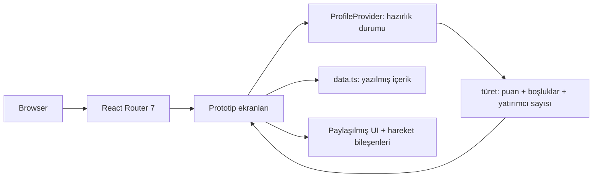

# YÖN

Girişimci odaklı bir ürün: finansman yolunu netleştirir ve girişimciyi bu yolda yürümeye hazırlar — onaylanmış bir tasarım spesifikasyonundan tamamen etkileşimli bir ön yüz prototipi olarak inşa edildi.

## Genel Bakış

YÖN, erken aşamadaki girişimciler için bir üründür: herhangi bir finansman kaynağına yaklaşmadan önce nerede durduklarını anlamaya ihtiyaç duyanlar için. Temel fikir: yapılandırılmış bir değerlendirme, bir finansman yolu oluşturur — başlangıcın mevcut durumuna göre hangi rotaların anlamlı olduğunu gösterir — ve bir hazırlık tanısı ile önceliklendirilmiş boşluklar ve bunları kapatmak için kişiselleştirilmiş bir eylem planı sunar.

Repo bir ön yüz prototipi içerir. Ürün modeli (aşağıda açıklanmıştır) amaçlanan uçtan uca yolculuğu tanımlar; prototip, temel girişimci odaklı etkileşim modelini uygular. Arka uç yok, veritabanı yok ve kalıcılık yok — durum ve içerik uygulama içindeki yazılmış bir modülde yaşar.

Durum: https://yon-dev.vercel.app/ adresinde çalışan demo (önizleme yapısı). Üretim sistemi değil.

## Problem

İlk finansman turuna yaklaşan girişimciler nadiren şirketleri kötü olduğu için başarısız olurlar. Hazırlıksız geldikleri için başarısız olurlar — herhangi bir finansman kaynağının soracağı soruları cevaplayamamak ve birçok olası boşluktan hangisinin aslında önce önemli olduğunu belirleyememek.

"Pitch'inizi geliştirin" eyleme geçirilebilir değil. "Finansal modeliniz eksik ve bu, aşamanızla ilgili iki program için engelleyici olan spesik öğe" ise eyleme geçirilebilir. YÖN'ün varsayımı şudur: yapılandırılmış bir hazırlık değerlendirmesi bu özgünlüğü ortaya çıkarabilir — ve bunu herhangi bir ulaşımdan önce yapmak hem girişimci hem de değerlendirici için önemli zaman tasarrufu sağlar.

## Ürün Modeli

### Amaçlanan Girişimci Yolculuğu

YÖN yedi aşamalı bir döngü etrafında tasarlanmıştır:

1. **Değerlendirme** — Şirket, ekip, ürün ve traction, finansallar ve hedef, ve doküman hazırlığını kapsayan yapılandırılmış bir giriş.
2. **Finansman Yolu** — Değerlendirme sonuçlarına dayanarak, YÖN başlangıcın mevcut profiliyle ilgili finansman rotalarını ortaya çıkarır (grant programları, hızlandırıcılar, melek, VC, veya herhangi bir kaynağa yaklaşmadan önce doğrulama önerisi). YÖN yolu netleştirir; uygunluk veya finansman sonuçlarını garanti etmez.
3. **Hazırlık Tanısı** — Bir hedef eşiğe karşı genel hazırlık puanı, kategori bazlı ayrışma ile.
4. **Kritik Boşluklar** — İlerlemeyi engelleyen spesik öğeler, öncelik sırasına göre, her boşluğun ilgili finansman kaynağı için neden önemli olduğu açıklamasıyla.
5. **Kişiselleştirilmiş Eylem Planı** — Belirlenen boşlukları doğru sırada kapatmak için yapılandırılmış bir yol haritası.
6. **İlerleme Takibi** — Girişimci plan üzerinde çalışırken eylem planına karşı ilerlemenin sürekli görünümü.
7. **Yeniden Değerlendirme** — Döngü kapanır: boşluklar kapandıkça, girişimci yeniden değerlendirir ve finansman yolu buna göre güncellenir.

### Prototipin Uyguladığı

Mevcut prototip girişimci odaklı yolculuğun çoğunu kapsar:

| Yolculuk Aşaması | Prototip Ekranı | Durum |
|---|---|---|
| Değerlendirme | `/girisim/degerlendirme` | ✅ Uygulandı |
| Finansman Yolu | _(değerlendirmeden türetilmiş; ayrı ekran yok)_ | 🔲 Bu yapıda ayrı ekran değil |
| Hazırlık Tanısı | `/girisim/rapor` | ✅ Uygulandı |
| Kritik Boşluklar | `/girisim/rapor` içinde bölüm | ✅ Uygulandı |
| Kişiselleştirilmiş Eylem Planı | `/girisim/yol-haritasi` | ✅ Uygulandı |
| İlerleme Takibi | `/girisim/ilerleme` | ✅ Uygulandı |
| Yeniden Değerlendirme | _(döngünün amaçlanan sonraki yinelemesi)_ | 🔲 Ayrı tamamlanmış özellik değil |

Uygulanan girişimci akışı temel etkileşim modelini gösterir: bir değerlendirme cevabını değiştirmek, hazırlık tanısını, belirlenen boşlukları ve eylem planını paylaşılmış durum modeli üzerinden günceller.

## Finansman Yolu

YÖN'ün merkezi ürün fikri şudur: her başlangıcın her finansman kaynağına yaklaşması gerekmez — ve hazır olmadan kapıya varmak her iki taraf için de maliyetlidir. Değerlendirmeye dayanarak, YÖN başlangıcın mevcut profiliyle en ilgili rotaları ortaya çıkarır: kamu grant programları (örn. TÜBİTAK/BiGG, KOSGEB), hızlandırıcı programları, melek ağları veya risk sermayesi. Herhangi bir yapılandırılmış finansman için henüz hazır olmayan başlangıçlar için bu sonucu da ortaya çıkarır, birlikte oraya ulaşmak için gereken spesik adımlarla.

YÖN uygunluğu belirlemez veya sonuçları garanti etmez. YÖN, girişimcinin hazırlık çabasını nereye odaklayacağı hakkında daha bilinçli bir karar vermesi için manzarayı netleştirir.

## Yatırımcı Katmanı

Prototip tam bir yatırımcı tarafı yolculuğu içerir: yatırım kriterleri yapılandırması (`/yatirimci/kriterler`), filtrelenmiş deal-flow pipeline'ı (`/yatirimci/dealflow`), detaylı başlangıç profili görünümü (`/yatirimci/girisim/:id`), ve girişimci için eşleşen yatırımcılar ekranı (`/girisim/yatirimcilar`) uyum puanları ve kriter bazlı eşleşme ayrışması gösterir.

Bu katman prototipte tamamen uygulanmış ve gezilebilir. Ancak, ürünün birincil konumlandırması değildir. YÖN'ün temel değer önerisi girişimci odaklıdır: finansman yolunu netleştirmek ve onu yürümeye hazırlanmak. Yatırımcı katmanı, aynı temel hazırlık değerlendirmesinin masanın diğer tarafını nasıl destekleyebileceğini gösterir — ancak yatırımcı eşleştirmesi, mevcut ürün yönünde ikincil bir husustur, öncelikli özellik değildir.

## Rolüm

Tek geliştirici. Uygulamanın tamamını uyguladım:

- Yedi onaylanmış ekranı yeniden tasarlamadan React bileşenlerine çevirdim, tasarım belgesinden renk ve tipografi tokenlarını CSS özel özellik katmanına örnekledim.
- Paylaşılmış hazırlık durum katmanını tasarladım (`src/state/profile.tsx`) — girişimcinin değerlendirme cevaplarını sahiplenen ve bunlardan puanı, boşluk listesini ve yatırımcı sayısını türeten bir React bağlamı, böylece her ekran kendi kopyasını tutmak yerine tek bir gerçeği okur.
- Puanlama ve açma kurallarını uyguladım: alan bazlı puan ve yatırımcı deltasları, sınırlama, ve spesik eksik öğeden spesik yatırımcıya eşlemeyi.
- Yatırımcı tarafı kriter modelini uyguladım: kriterler sıkılaştıkça nitelikli havuzu daraltan bir genişlik × baş boşluk × katılık hesaplaması.
- Paylaşılmış bileşen kütüphanesini (`Card`, `Btn`, `Chip`, `Pill`, `SegBar`, `Avatar`, `Check`, `Micro`) ve rol farkında kenar çubuğu navigasyonu ile uygulama kabuğunu inşa ettim.
- Hareket sistemini inşa ettim: tek bir kolaylaştırma eğrisinde üç süre katmanı, basamaklı ifşalar, ve ortadaki kesintiye devam eden özel bir `requestAnimationFrame` kancası tarafından sürülen animasyonlu bir sayacı.
- Azaltılmış hareket için erişilebilirlik davranışını iki seviyede uyguladım — kök `MotionConfig reducedMotion="user"` ve `prefers-reduced-motion` CSS bloğu — böylece içerik kaybolmak yerine yerinde görünür.
- Oluşturma ve Vercel dağıtımını yapılandırdım.

Geliştirme sırasında AI kodlama yardımı kullanıldı; mimari, durum modeli, puanlama kuralları ve nihai kod benim ve gönderilen her şeyi gözden geçirdim.

## Mimari

Sunucu bileşeni olmayan tek sayfalı bir React uygulaması. Durum bir React bağlamında yaşar; içerik yazılmış bir modülde yaşar; yönlendirme istemci tarafıdır.

- **Ön yüz:** React 19, TypeScript (strict), Vite 6, React Router 7, Framer Motion 13.
- **Durum:** tek bir React bağlam sağlayıcısı. Değerlendirme cevapları tek saklanan durumdur; puan, boşluk listesi, eşleşme sayısı ve yatırımcı açmaları tümü türetilmiş değerlerdir, asla saklanmaz.
- **Stil:** bir token katmanı, bir temel katman ve yüzey bazlı katmanlara bölünmüş elle yazılmış CSS. UI çerçevesi yok.
- **Fontlar:** `@fontsource` üzerinden Plus Jakarta Sans ve IBM Plex Mono — çalışma zamanında harici CDN bağımlılığı yok.
- **Arka uç / veritabanı / kimlik doğrulama:** yok. Bu repo'da uygulanmadı.
- **Dağıtım:** Vercel üzerinde statik yapı.

## Temel Teknik Kararlar

**Türet, asla çoğaltma.** Bağlam değerlendirme cevaplarını ve başka bir şeyi saklar. Puan, boşluk listesi, yatırımcı sayısı ve açılan yatırımcı seti her render'da bu cevaplardan hesaplanır. Bu nedenle değerlendirmede bir alanı değiştirmek tanıyı, boşluk listesini ve yatırımcı ekranını herhangi bir senkronizasyon kodu olmadan tutarlı olarak günceller.

**Veri tablosu olarak puanlama, dallanma mantığı değil.** Her alan, bir tabana karşı uygulanmış ve sınırlanmış, mümkün olan her cevap için küçük bir `{ puan, yatırımcılar }` deltası tablosuna eşler. Herhangi bir tek öğenin ağırlığını değiştirmek bir sabite tek satırlık bir düzenlemedir. Tüm ağırlıklandırma modeli kabaca on beş satırda denetlenebilir.

**Kilitli eşleşmeler açıkça modellenmiş.** Yatırımcıları sessizce filtrelemek yerine, her kilitli yatırımcı onu engelleyen hazırlık anahtarına bağlıdır, böylece UI hangi boşluğun yolda olduğunu ve kapatıldığında uyum puanının ne olacağını belirtebilir. Bu bir filtreyi eyleme geçirilebilir rehberliğe dönüştürür — ikincil bir ürün katmanı bağlamında bile.

**Geçişi sayının içinde tut.** Animasyonlu sayaç kendi `requestAnimationFrame` döngüsünü çalıştırır ve hedef ortamda değiştiğinde, sıçrayıp yeniden başlamak yerine mevcut değerinden devam eder. Kullanıcı izlerken 72 → 81 hareket eden bir puan, ürünün değerinin indiği andır; bir kes-atma bunu boşa harcar.

**İmza ilkel olarak bölünmüş bir çubuk.** `SegBar` bir oranı ayrık dikey segmentler olarak işler ve mevcut değer ile bir hedef eşik arasındaki span'u bir uyarı renginde gölgeleyebilir — hazırlık çubuğunu, kategori ayrışmalarını, kriter eşik kaydırıcısını ve canlı sonuç panelini kapsayan tek bir bileşen.

## Temel Özellikler

**Girişimci finansman-hazırlık döngüsü**
- Cevaplar değiştikçe güncellenen canlı yansıtılan puan ile çok bölümlü başlangıç değerlendirmesi.
- Genel puan ve kategori bazlı ayrışma ile hazırlık tanısı.
- Her boşluğun ilgili finansman kaynağı için neden önemli olduğu açıklamasıyla öncelik sırasına göre kritik boşluklar.
- Boşlukları kapatmak için kişiselleştirilmiş eylem planı ve ilerleme takibi.

**Yatırımcı katmanı** *(prototipte uygulandı; girişimci yolculuğuna ikincil)*
- Yatırımcı başına açık karşılanmış / karşılanmamış kriter listesi ile yatırımcı eşleştirme — uyum opak bir yüzde değil, açıklanabilir.
- Spesik eksik öğeye bağlı kilitli eşleşmeler, kapatıldığında açacağı uyum puanını gösterir.
- Sektörler, aşamalar, coğrafyalar, eşik ve katılık değiştikçe yeniden hesaplanan canlı nitelikli havuz sayısı ile yatırımcı kriterleri yapılandırması.
- Durum sekmeleri ve başlangıç başına hazırlık / uyum göstergeleri ile filtrelenmiş deal-flow pipeline'ı.
- Hazırlık ayrışması, "neden bu eşleşti" gerekçesi ve risk listesi ile başlangıç detay görünümü.

**Ürün temeli**
- Tokenlar, paylaşılmış bileşenler ve hem kütüphane hem de CSS seviyesinde azaltılmış hareket desteği ile tam bir tasarım sistemi.

## Teknik Zorluklar

**İki kullanıcı yolculuğunu tek bir modelden tutarlı tutmak.** Girişimci ekranları ve yatırımcı ekranları aynı temel değerlendirmeyi zıt yönlerden sunar — bir tarafta iyileştirilecek bir puan, diğer tarafta uygulanacak bir filtre. Yaklaşım: türetmeyi tek bir yere koyun ve her iki tarafın da okumasına izin verin, her ekranın ihtiyacını hesaplamasına izin vermek yerine. Sonuç: demonun merkezi etkileşimi — bir cevabı değiştirin, puanı, raporu ve eşleşme listesinin hepsinin birlikte hareket ettiğini izleyin — çapraz ekran kablo bağlantısı olmadan çalışır.

**Canlı yeniden hesaplamayı gerçek bir sistem gibi hissettirmek.** Yatırımcı kriter paneli beş etkileşen girdiye anında olası bir sayı üretmek için yanıt vermelidir. Yaklaşım: kriterlerin üç eksen boyunca genişliğini, hazırlık eşiğinden baş boşluğunu ve gerekli kriter başına katılık cezasını birleştiren tek bir `useMemo`, tasarımın varsayılan yapılandırmasının tasarımın belirtilen sonucunu yeniden üretecek şekilde kalibre edilmiş. Sonuç: her kontrol görünür, yönsel olarak doğru bir etkiye sahiptir ve kalibrasyon kodda belgelenmiştir, böylece sayılar gizemli değildir.

**Kesintiden kurtulan hareket.** İfşa animasyonları ve sayaçlar kullanıcı girişiyle örtüşür. Yaklaşım: tek bir paylaşılan süre/kolaylaştırma ailesi, kendi animasyon çerçeve döngüsünü sahiplenen ve canlı mevcut değerini okuyan bir kanca, ve hem kütüphane hem de CSS seviyelerinde azaltılmış hareket işleme. Sonuç: hızlı etkileşim asla UI'ı yarı animasyonlu durumda bırakmaz ve azaltılmış hareket etkin olan kullanıcılar hareketten başka bir şey kaybetmez.

## Ürün / Mühendislik Sonucu

Girişimci finansman-hazırlık yolculuğunu birden çok ekran boyunca kapsayan ve yatırımcı katmanını ikincil ancak tamamen gezilebilir bir akış olarak uygulayan tam, dağıtılmış, etkileşimli bir prototip. Tasarlanmış tüm ekranlar uygulandı, her iki yolculuk uçtan uca yürünebilir, ve temel ürün döngüsü — bir cevabı değiştirin, hazırlık puanını, boşluk listesini ve eylem planının yanıtını izleyin — taklit edilmiş değil, işlevseldir.

Ne olmadığı: arka uç yok, kullanıcı hesabı yok, kalıcılık yok ve gerçek yatırımcı veya finansman kaynağı verisi yok. Repo kullanım metrikleri içermez ve hiçbiri iddia edilmez.

## Mevcut Durum

**Uygulandı**
- Değerlendirme (`/girisim/degerlendirme`) — canlı puan ve boşluk yansıtması ile beş bölümlü giriş.
- Hazırlık tanısı ve kritik boşluklar (`/girisim/rapor`) — hedef eşiğe karşı puan, kategori bazlı ayrışma, öncelikli boşluk listesi.
- Kişiselleştirilmiş eylem planı (`/girisim/yol-haritasi`).
- İlerleme takibi (`/girisim/ilerleme`).
- Yatırımcı katmanı: eşleşen yatırımcılar (`/girisim/yatirimcilar`), kriter yapılandırması (`/yatirimci/kriterler`), deal-flow pipeline'ı (`/yatirimci/dealflow`), başlangıç detayı (`/yatirimci/girisim/:id`).
- Türetilmiş puanlama, boşluk listesi ve yatırımcı açma mantığı ile paylaşılmış hazırlık durumu.
- Tasarım token sistemi, paylaşılmış bileşen kütüphanesi, hareket sistemi, azaltılmış hareket desteği.
- Vercel üzerinde üretim yapısı.

**Bu prototipte uygulanmadı**
- Ayrı ekran olarak Finansman Yolu (şu an değerlendirme çıktısında örtük; ayrı rota yok).
- Tamamlanmış uçtan uca döngü kapanışı olarak yeniden değerlendirme.
- Arka uç API, veritabanı ve kalıcılık.
- Kimlik doğrulama ve kullanıcı hesapları.
- Gerçek finansman kaynağı veya yatırımcı verisi — tüm içerik örnek veridir.
- PDF dışa aktarma — UI'da eylem var; üretim uygulanmadı.

## Demo ve Dağıtım

**Üretim sitesi:** https://yon-dev.vercel.app/
- `/` — mevcut YÖN landing sayfası.
- Ürün rotaları — Yakında Gelecek; üretimde henüz erişilebilir değil.

**Geliştirme önizlemeleri:** taban tabanlı Vercel önizleme dağıtımları geliştirme ve inceleme için tam etkileşimli prototipi ortaya çıkarır. Tüm ekranlar ve her iki yolculuk (girişimci ve yatırımcı katmanı) orada gezilebilir.

| # | Ekran | Rota | Ne gösterir |
|---|--------|-------|--------------|
| 01 | Giriş | `/` | Ürün konumlandırma ve rol seçimi |
| 02 | Değerlendirme | `/girisim/degerlendirme` | Canlı puan ve boşluk paneli ile giriş formu |
| 03 | Hazırlık tanısı | `/girisim/rapor` | Eşik karşı puan, kategori ayrışması, boşluklar |
| 04 | Eylem planı | `/girisim/yol-haritasi` | Belirlenen boşlukları kapatmak için yapılandırılmış adımlar |
| 05 | İlerleme takibi | `/girisim/ilerleme` | Plana karşı ilerleme görünümü |
| 06 | Eşleşen yatırımcılar | `/girisim/yatirimcilar` | Uyum puanları, kriter bazlı ayrışma, kilitli eşleşmeler |
| 07 | Yatırımcı kriterleri | `/yatirimci/kriterler` | Canlı nitelikli havuz sayısı ile kriter yapılandırması |
| 08 | Deal flow | `/yatirimci/dealflow` | Durum sekmeleri ile filtrelenmiş pipeline |
| 09 | Başlangıç detayı | `/yatirimci/girisim/:id` | Tam profil: hazırlık, uyum gerekçesi, riskler |

Göstermek için en yararlı şey temel döngüdür: 02 ekranında, herhangi bir hazırlık cevabını değiştirin ve puanı, boşluk listesini ve planın gerçek zamanlı yanıtını izlemek için 03, 04 ve 05 ekranlarına ilerleyin.

## Teknoloji Yığını

**Ön yüz**
- React 19, TypeScript 5.7 (strict)
- React Router 7
- Framer Motion 13
- Özel özellik token katmanı ile elle yazılmış CSS

**Oluşturma ve araçlar**
- Vite 6, `@vitejs/plugin-react`
- `@fontsource` (Plus Jakarta Sans, IBM Plex Mono) — kendi kendine barındırılan, CDN yok

**Altyapı**
- Vercel (statik barındırma)

**Arka uç / veritabanı / AI**
- Bu repo'da yok.

## Repo

Özel repo — kaynak kodu herkese açık değil.

Herkese açık demo: https://yon-dev.vercel.app/

## Öğrendiklerim

**Türetmek saklamaktan daha iyidir.** Puanı cevapların yanında durumda saklamak ilk gün işe yarar ve üçüncü gün bozulur. Puanı cevapların saf bir fonksiyonu yapmak, onu okuyan her yeni ekranın doğru yapısını garanti etti — ve ürünün en önemli etkileşimini (iyileştirme döngüsünü) ayrı olarak inşa etmek yerine mimariden düşürmesini sağladı.

**Açıklanabilirlik bir veri modelleme kararıdır, kopyalama yazma kararı değil.** "%92 uyum" tek başına işe yaramaz. "Sektör, coğrafya, aşama ve hazırlık eşiğinde eşleşti; traction'da eşleşmedi" elde etmek, kriterleri baştan bireysel olarak değerlendirilebilir öğeler olarak modellemeyi gerektirdi. Veri bu şekli aldığında, arayüz dürüst olabilir; veri sadece bir sayıysa, herhangi bir UI çalışması gerekçeyi kurtaramaz.

**Görsel bir sistemi işlevsel bir ürüne çevirmek.** Kısıt, onaylanmış ekranları sadık olarak inşa etmekti, onları yeniden tasarlamak değil — bu mühendislik çabasını aslında önemli olan şeye itti: kaynağa sadık bir token katmanı, ekran başına animasyon yerine tek bir hareket dili, ve dört farklı bağlamda yeniden kullanılan paylaşılmış bir ilkel (`SegBar`). Referans güdümlü bir arayüzü uyarlamak, aynı anda üç şeyi dengelemek demektir: görsel niyet, etkileşim sadakati ve duyarlı davranış. Bunlar farklı yönlerde çektiğinde, cevap neredeyse her zaman çatışmayı bileşen katmanında, değil yerleşimde çözmektir.

**Bir prototipin ne iddia ettiğini bilmek.** Bu uygulama çalışan bir sistem gibi görünür, bu da aşırı tanımlamayı kolaylaştırır. Sınırı açık tutmak — gerçek mantık burada, örnek veri orada, arka uç hiç yok — şeyi sorumlu bir şekilde inşa etmenin bir parçasıdır, özellikle demo ürünü değerlendiren insanlara gösterildiğinde.

---

[English version: see README.md](./README.md)
